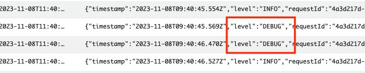

# Advanced Logging Controls Lambda Demo

The purpose of this project is to demonstrate how to use the advanced logging controls for Lambda, using AWS SAM to build and deploy the resources in your AWS account.

Using advanced logging controls you can capture logs in JSON structured format, allowing you to quickly search, filter, and analyze large volumes of log entries. You can also control the granularity of logs emitted by the Lambda function to debug and troubleshoot issues more effectively. Lastly, you can now choose the Amazon CloudWatch Log Group where Lambda sends logs to, making it easier to aggregate and manage logs at scale.

## Overview
The following diagram shows how you can use a couple of Lambda functions to process newly created objects inside an Amazon S3 bucket, where both functions emit logs into the same CloudWatch Log Group:
<p align="center"> 

</p>

The architecture includes the following steps:
1.	A new object is created inside an S3 bucket.
2.	S3 publishes an event using [S3 Event Notifications](https://docs.aws.amazon.com/AmazonS3/latest/userguide/EventNotifications.html) to [Amazon EventBridge](https://aws.amazon.com/eventbridge/).
3.	EventBridge triggers two Lambda functions asynchronously. 
4.	Each function processes the object to extract labels and text, using [Amazon Rekogniton](https://aws.amazon.com/rekognition/) and [Amazon Textract](https://aws.amazon.com/textract/) (respectively).
5.	Both functions then emit logs into the same CloudWatch Log Group.

This project contains source code and supporting files for a serverless application that you can deploy with the SAM CLI. It includes the following files and folders.

- detect-labels - AWS Lambda function code to detect labels inside an image using Amazon Rekognition, written in TypeScript (NodeJS 18.x).
- extract-text - Lambda function's code to extract text inside an image using Amazon Textract, written in TypeScript (NodeJS 18.x).
- samples - Sample image(s) you can use to test the application.
- template.yaml - A template that defines the application's AWS resources, using AWS SAM.

Each function definition (in the `template.yaml` file) contains a `LoggingConfig` configuration. For example:
```yaml
      LoggingConfig:
        LogFormat: JSON # Application logs format, defaults to JSON (TEXT is optional)
        ApplicationLogLevel: DEBUG # Application log level, defaults to INFO
        SystemLogLevel: INFO # System log level, defaults to INFO
        LogGroup: !Ref CloudWatchLogGroup # Customized log group to emit logs to
```

- `LogFormat` - allows you to choose between text and JSON format for your logs.
- `ApplicationLogLevel` - for application logs (which are logs generated by your function code) you can choose between `TRACE`, `DEBUG`, `INFO` (default), `WARN`, `ERROR` and `FATAL`, where the `TRACE` log-level provides the most fine-grained information, and `FATAL` provides the least. 
- `SystemLogLevel` - for system logs (the logs generated by the Lambda service) you can choose between `DEBUG`, `INFO` (default) and `WARN`.
- `LogGroup` - ARN of a custom log group, where the Lambda functions sends logs to. 

For your function to send logs to CloudWatch Logs, it must have the `logs:PutLogEvents` and `logs:CreateLogStream` permissions. When you configure your function's log group using the Lambda console, if your function doesn't have these permissions, Lambda adds them to the function's execution role by default. When Lambda adds this permission, it gives the function permission to send logs to any CloudWatch Logs log group.
When you use SAM to configure your function, you must explicitly add these permissions:
```yaml
      Policies:
        - Version: 2012-10-17
          Statement:
            - Sid: CloudWatchLogGroup
              Action: 
                - logs:CreateLogStream
                - logs:PutLogEvents
              Resource: !GetAtt CloudWatchLogGroup.Arn
              Effect: Allow

```

## Deploying the application
Clone the GitHub repository and explore the application.

```bash
git clone https://github.com/aws-samples/advanced-logging-controls-lambda/ 
cd advanced-logging-controls-lambda
```

Use AWS SAM to build and deploy the resources to your AWS account:
1. Build the solution using AWS SAM. This will compile and build the application using npm, and then populate the template required to deploy the resources:
    ```bash
    sam build
    ```

2. Deploy the solution to your AWS account with a guided deployment. Replace the bucket name with a unique name of your choosing:
    ```bash
    sam deploy --guided --parameter-overrides UploadsBucketName=example-s3-images-bucket
    ```

3. Accept the initial defaults.

4. Use AWS CLI to copy an image into the Amazon S3 bucket you just created. You can use the sample image provided:
    ```bash
    aws s3 cp samples/skateboard.jpg s3://example-s3-images-bucket
    ```

## Exploring the results 
Explore CloudWatch Logs to view the logs emitted into the log group created, `AggregatedLabelsLogGroup`:
<p align="center"> 

</p>

The DetectLabels Lambda function emits `DEBUG` log events in JSON format to the log stream. Log events with the same log level from the ExtractText Lambda function are omitted. This is a result of the different application log level settings for each function (`DEBUG` and `INFO`).

Use [CloudWatch Logs Insights](https://docs.aws.amazon.com/AmazonCloudWatch/latest/logs/AnalyzingLogData.html) to search, filter, and analyze the logs in JSON format using this sample query. The query parse the JSON logs and filter only the logs events containing the S3 object key we copied earlier:
```
fields @timestamp, message.S3Bucket as bucket, message.S3Key as key, @message, @logStream, @log
| filter key = 'skateboard.jpg'
| sort @timestamp desc
| limit 20
```

## Cleanup

To delete the sample application that you created, use the AWS CLI. Assuming you used your project name for the stack name, you can run the following:

```bash
sam delete --stack-name advanced-logging-controls-lambda
```

## Resources

Learn more about [AWS Lambda Advanced Logging Controls](https://docs.aws.amazon.com/lambda/latest/dg/monitoring-cloudwatchlogs.html).

See the [AWS SAM developer guide](https://docs.aws.amazon.com/serverless-application-model/latest/developerguide/what-is-sam.html) for an introduction to SAM specification, the SAM CLI, and serverless application concepts.

## License

This library is licensed under the MIT-0 License. See the LICENSE file.