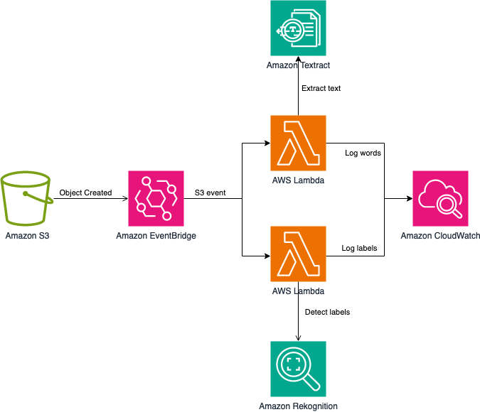

# Advanced Logging Controls Lambda Demo

The purpose of this project is to demonstrate how to use the advanced logging controls for Lambda, using AWS SAM to build and deploy the resources in your AWS account.

Using advanced logging controls you can capture logs in JSON structured format, allowing you to quickly search, filter, and analyze large volumes of log entries. You can also control the granularity of logs emitted by the Lambda function to debug and troubleshoot issues more effectively. Lastly, you can now choose the Amazon CloudWatch Log Group where you want to receive you Lambda function logs, making it easier to aggregate and manage logs at scale.

## Solution Overview
The following diagram shows how you can use a couple of Lambda functions to process newly created objects inside an Amazon S3 bucket, where both functions emit logs into the same CloudWatch Log Group:
<p align="center"> 

</p>

The architecture includes the following steps:
1.	A new object is created inside an Amazon S3 bucket.
2.	Amazon S3 publishes an event using Amazon S3 Event Notifications to Amazon EventBridge.
3.	EventBridge triggers two Lambda functions asynchronously. 
4.	Each function processes the object to extract labels and text, using Amazon Rekogniton and Amazon Textract (respectively).
5.	Both functions then emit logs into the same CloudWatch Log Group.

This project contains source code and supporting files for a serverless application that you can deploy with the SAM CLI. It includes the following files and folders.

- detect-labels - AWS Lambda function code to detect labels inside an image using Amazon Rekognition, written in TypeScript (NodeJS 18.x).
- extract-text - Lambda function's code to extract text inside an image using Amazon Textract, written in TypeScript (NodeJS 18.x).
- samples - Sample image(s) you can use to test the application.
- template.yaml - A template that defines the application's AWS resources, using AWS SAM.

## Deployment
Clone the repository from the GitHub repository and explore the application. The README file contains additional information.

```bash
git clone https://github.com/aws-samples/advanced-logging-controls-lambda/ 
cd advanced-logging-controls-lambda
```

You can use AWS SAM to build and deploy the resources to your AWS account:
1. Build the solution using AWS SAM. This will compile and build the application using npm, and then populate the template required to deploy the resources:
```bash
sam build
```

2. Deploy the solution to your AWS account with a guided deployment. Replace the bucket name with a unique name of your choosing:
```bash
sam deploy -g --parameter-overrides UploadsBucketName=example-s3-images-bucket
```

3. Accept the initial defaults.

4. Use AWS CLI to copy an image into the Amazon S3 bucket you just created. You can use the sample image provided:
```bash
aws s3 cp samples/skateboard.jpg s3://example-s3-images-bucket
```

After a few seconds, you can use CloudWatch Logs to view the logs emitted into the log group created, AggregatedLabelsLogGroup:

## Cleanup

To delete the sample application that you created, use the AWS CLI. Assuming you used your project name for the stack name, you can run the following:

```bash
sam delete --stack-name advanced-logging-controls-lambda
```

## Resources

Learn more about [AWS Lambda Advanced Logging Controls](https://aws.amazon.com/lambda/advanced-logging-controls).

See the [AWS SAM developer guide](https://docs.aws.amazon.com/serverless-application-model/latest/developerguide/what-is-sam.html) for an introduction to SAM specification, the SAM CLI, and serverless application concepts.

Next, you can use AWS Serverless Application Repository to deploy ready to use Apps that go beyond hello world samples and learn how authors developed their applications: [AWS Serverless Application Repository main page](https://aws.amazon.com/serverless/serverlessrepo/)

## License

This library is licensed under the MIT-0 License. See the LICENSE file.