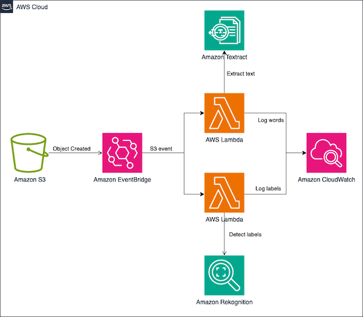

# Advanced Logging Controls Lambda Demo

Advanced Logging Control for AWS Lambda 

## Solution Overview
<p align="center"> 

</p>


This project contains source code and supporting files for a serverless application that you can deploy with the SAM CLI. It includes the following files and folders.

- hello-world - Code for the application's Lambda function written in TypeScript.
- events - Invocation events that you can use to invoke the function.
- hello-world/tests - Unit tests for the application code. 
- template.yaml - A template that defines the application's AWS resources.

## Cleanup

To delete the sample application that you created, use the AWS CLI. Assuming you used your project name for the stack name, you can run the following:

```bash
sam delete --stack-name advanced-logging-controls-lambda
```

## Resources

See the [AWS SAM developer guide](https://docs.aws.amazon.com/serverless-application-model/latest/developerguide/what-is-sam.html) for an introduction to SAM specification, the SAM CLI, and serverless application concepts.

Next, you can use AWS Serverless Application Repository to deploy ready to use Apps that go beyond hello world samples and learn how authors developed their applications: [AWS Serverless Application Repository main page](https://aws.amazon.com/serverless/serverlessrepo/)

## License

This library is licensed under the MIT-0 License. See the LICENSE file.